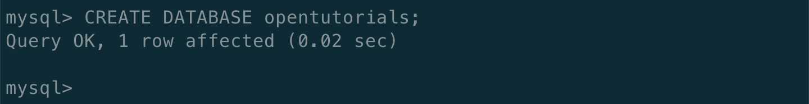
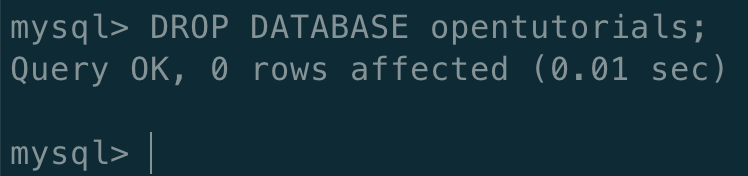
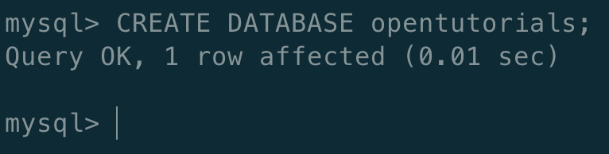
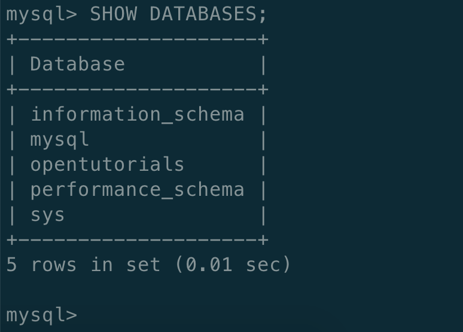
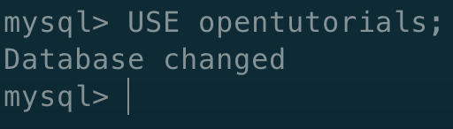

# 5. MySQL 스키마 \(Schema\)의 사용

## MySQL 스키마의 사용

* CREATE DATABASE opentutorials;
  * opentutorials 라는 이름을 가진 DATABASE 를 CREATE

* DROP DATABASE opentutorials;
  * opentutorials 라는 이름을 가진 DATABASE 를 DROP \(삭제\)

* SHOW DATABASES;
  * 우리가 만든 opentutorials 라는 Database 가 존재한다.

* USE opentutorials;
  * 지금부터 MySQL 은 우리가 내리는 명령을 opentutorials 라고 하는 schema 에 있는 표를 대상으로 명령을 실행한다.

