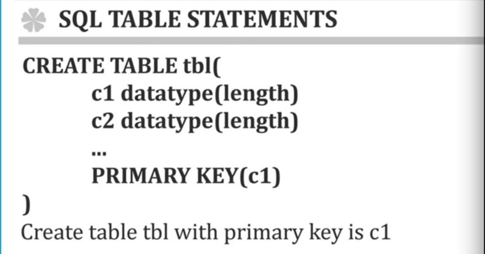

# 7. MySQL 테이블의 생성

## 테이블의 생성 \(1\)

* id 를 입력할때, 숫자와 문자가 중구난방으로 있으면 데이터를 정리하기 힘들다. 따라서 하나의 약속같이 숫자면 숫자, 문자면 문자만 id 에 입력하라고 하는데 이 때 필요한 것 중 하나가 INT\(m\) 이다.
  * 여기서 m 은 숫자를 얼마까지 저장할 것인지가 아니라, 얼마까지 노출할 것인가이다.

* CREATE TABLE topic \(
  * topic 이라는 이름을 가진 TABLE 을 CREATE
* id INT\(11\) NOT NULL
  * NOT NULL 이라 하면, id 는 비어있지 않은 즉, 값이 꼭 있어야
* id INT\(11\) NOT NULL AUTO\_INCREMENT,
  * id 의 값이 1 씩 자동으로 증가하는, 즉 엑셀에서 id 가 1, 2, 3, 4, ... 이렇게 증가하듯이
* 이렇게 하면 id 라고 하는 하나의 column 이 완성됐다

## 테이블의 생성 \(2\)

* 엑셀에서는 title 의 글자수를 제한할 수 없다. 하지만, MySQL 에서는 할 수 있는데, title 이 너무 길면 안되므로, VARCHAR\(size\) 를 이용해 255 characters 가 넘어가면 255까지만 표시하고 넘어가는 것은 자르자.

* title VARCHAR\(100\) NOT NULL,
  * title 의 글자수는 100으로 제한하고 비어있으면 안된다.

* description TEXT NULL,
  * TEXT 는 65,535 characters 를 가진 String datatype 이고 NULL 이라 함은 값이 없어도 된

* PRIMARY KEY\(id\);
  * id 값은 중복되면 안되므로, MySQL 에게 id 값이 primary 하다고 알려줘야한다.

