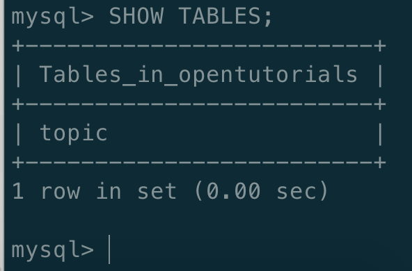
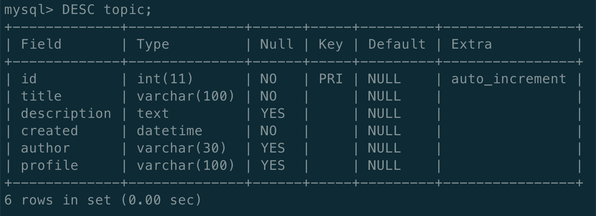
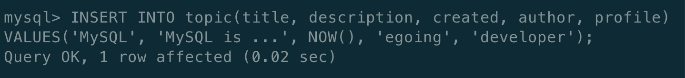
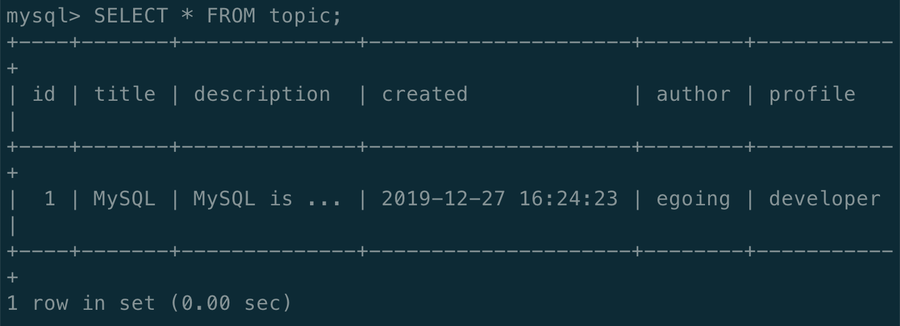
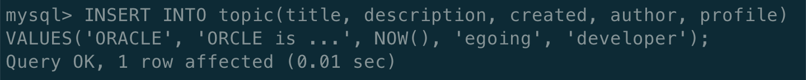
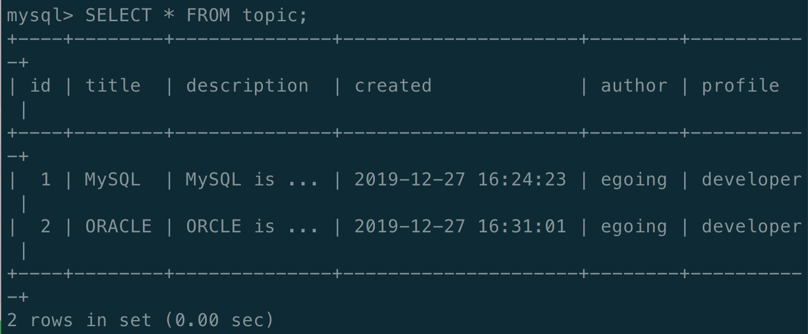

# 9. SQL의 INSERT 구문

## SQL 의 INSERT

* SHOW TABLES;
  * 우리가 그 전에 작성한 topic 이라는 이름을 가진 TABLE 이 opentutorials 라는 DATABASE 에 있는 것을 볼 수 있다.

* DESC topic;
  * topic 이라는 이름을 가진 table 을 Describe \(DESC\)

* 각각의 topic 에 맞는 것들을 VALUES 안의 값들과 하나씩 매칭시켜서 INSERT 한다. 여기서 id 는 적지 않은 이유가 auto\_increment 이기 때문에 알아서 증가하라고 한다.

## Read

* SELECT \* FROM topic;
  * topic 이라는 table 에 새로 넣은 값들을 보여준다.

* 새로 넣은 값들이 INSERT 되었음을 알 수 있다.

