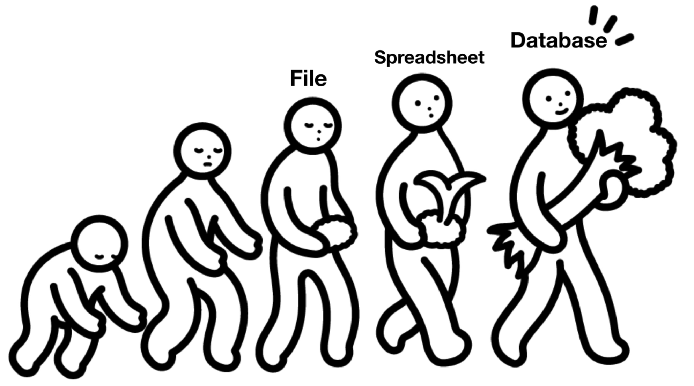
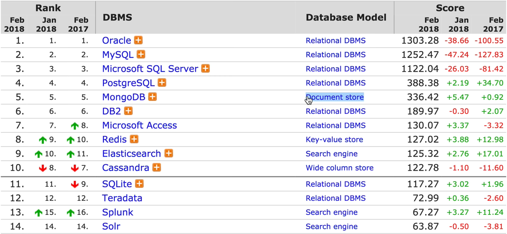

# 1. 데이터베이스의 본질

* Oracle 은 대기업 및 공공기관에서 많이 쓰인다. \(비용이 매우비쌈\)
* MySQL 은 open source 기반 Database 이다.
* 2015년까지는 Relational DBMS 가 거의 독점하고 있었는데, Social media 및 IoT 발전으로 인해, Document store model 인 MongoDB 가 발전하게 된다.

